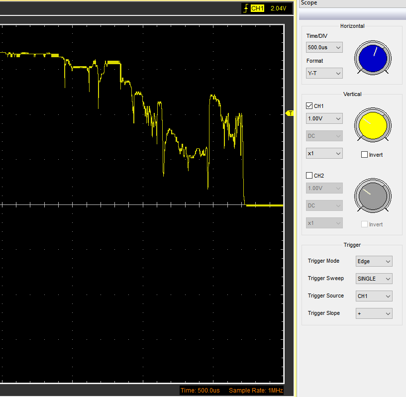

# weltec-blinkyled
A software debounce implementation with a serial interface to demonstrate that it is in fact debouncing.

Button presses are recorded using interrupts.

## Hardware setup
This was put together using a Teensy 3.2, a button, an LED and a 330 Ohm resistor.

## Pre-debounce

As shown in the oscillogram below, a switch state change can be very shakey. This needs to be handled either in software or hardware (or both). This is a software only implementation.

## Demonstration of debounce functioning

After debouncing we can see that the LED state only changes in line with button presses. As this is difficult to see with the naked eye software counters have been added that can be accessed over the Serial Interface. The results are as follows:

